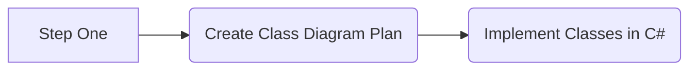
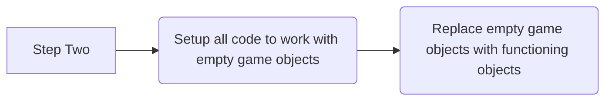
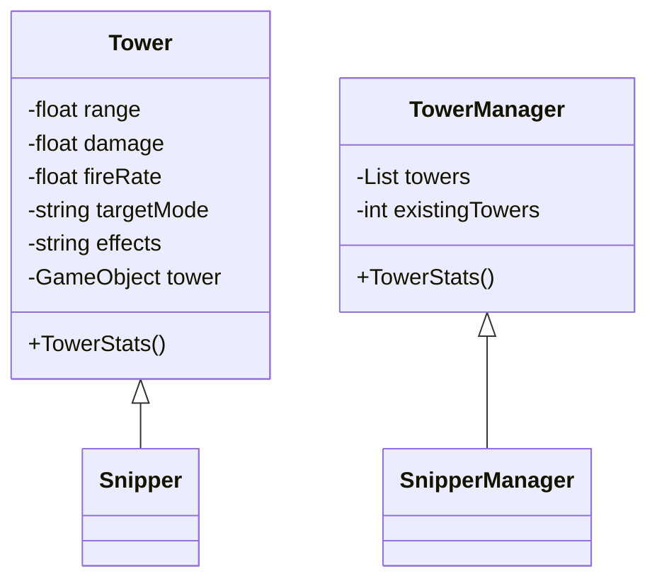

# Contents
```table-of-contents
title: 
style: nestedList # TOC style (nestedList|nestedOrderedList|inlineFirstLevel)
minLevel: 0 # Include headings from the specified level
maxLevel: 0 # Include headings up to the specified level
includeLinks: true # Make headings clickable
hideWhenEmpty: false # Hide TOC if no headings are found
debugInConsole: false # Print debug info in Obsidian console
```

# Analysis
## The Problem
Late at night, while in a call with my friends, I often find myself feeling bored, but not wanting to commit to anything complicated, now I could go to bed but as a teenager I inherently avoid early bedtimes. I just crave something simple to engage me, a quick, easy distraction preferably a game. Curious about what my friends were doing in similar moments, I asked them, but they were often the same, either doing nothing or just aimlessly jumping around in whatever game they're playing. I noticed the same thing about me actually, we all seem to lean towards jumping around, there seems to be something mildly satisfying about bouncing about in a game.

So I began looking for games that could satisfy this craving, but found that most were either too complex for my sleep deprived brain or too lengthy to enjoy for an hour before bed. Frustrated with the lack of a perfect option, I decided to simply create my own solution: $\mathrm{the perfect game^{TM}}$ - not actually trademarked - that game will allow me and my friends to jump around while completing little tasks along the way, offering a brief but satisfying distraction.

I have received their agreement that they will help test the development of my game alongside its progress.

# Plan
## Minigame One






# idk yet
## Used Resources
C418 - Music
Mojang Studios - Menu Sounds
Sprites and Backgrounds - [Pixel Platformer · Kenney](https://www.kenney.nl/assets/pixel-platformer)
UI - [UI Pack · Kenney](https://www.kenney.nl/assets/ui-pack)

# User Feedback
## Suggestions
- [ ] Have the ending of the game be the character going to bed to implore the players to also head to sleep, closing the application behind it.
- [ ] Have the game load levels randomly on start so its not repetitive.
- [ ] Allow rebindable keybinds.
	- [ ] Allow different keybinds for one action.

## Issues
