# Contents
```table-of-contents
title: 
style: nestedList # TOC style (nestedList|nestedOrderedList|inlineFirstLevel)
minLevel: 0 # Include headings from the specified level
maxLevel: 0 # Include headings up to the specified level
includeLinks: true # Make headings clickable
hideWhenEmpty: false # Hide TOC if no headings are found
debugInConsole: false # Print debug info in Obsidian console
```

# Analysis
## The Problem
Late at night, while in a call with my friends, I often find myself feeling bored, but do not wish to commit to anything complex, although I could simply go to bed, I, like many teenagers tend to avoid early bedtimes. I just crave something simple to engage me, a quick, easy distraction preferably a game. Curious about what my friends were doing in similar moments, I asked them, but they were often the same, either doing nothing or just aimlessly jumping around in whatever game they're playing. I noticed the same thing about me actually, we all seem to lean towards jumping around, there seems to be something mildly satisfying about bouncing about in a game.

So I began looking for games that could satisfy this craving, but found that most were either too complex for my sleep deprived brain or too lengthy to enjoy for an hour before bed. Due to the lack of an ideal option, I decided to develop my own solution: a game designed to provide a simple yet satisfying experience before bed. The game will allow me and my friends to jump around while completing little tasks along the way, offering a brief but satisfying distraction.

I have received their agreement that they will help test the development of my game along its progress. As well as provide feedback. My target demographic consists of teenagers who engage in frequent gaming and seek low-commitment entertainment options late at night.

## Research
### Online
After researching this phenomenon I discovered it had a name "Revenge Bedtime Procrastination" (sometimes revenge is excluded) and it wasn't just prevalent in teenagers but also adults. This led  me to update my target audience to include all ages.

Revenge bedtime procrastination is where individuals deliberately delay going to bed to reclaim some relaxation time that is otherwise lost in their daytime due to things such as school or work. It's particularly common among teenagers, whose busy schedules from homework and revision and early school start times leave them with little time for relaxation. Research from Wikipedia and by the Sleep Foundation indicates that many young people, despite knowing they need to sleep more, fall into a cycle where immediate activities that give dopamine (like gaming, scrolling social media, or watching TV) overpowers their intention to get enough rest.

Studies suggest that as the day progresses, the self-control of individuals tends to diminish, making them more susceptible to procrastinating. Additionally, having a digital device worsens this effect by delaying melatonin production shifting the natural sleep cycle further. Research from Verywell Mind (linked in references) highlights that for many, this delay isn’t about avoiding sleep but about regaining a sense of control after a day filled with work.

However the long-term consequences of sleep delay can be significant. Chronic sleep deprivation as a result of consistent bedtime procrastination is often associated with impaired cognitive function, poor academic performance, and a higher risk of mood disorders such as anxiety and depression. Moreover, the habit of sacrificing sleep can lead to a cycle of worsening sleep quality and overall health.

After realising its detrimental effects I was driven to update my goals from just providing a source of entertainment to also promoting better sleep. Hopefully when people are procrastinating they decide to launch my game in which I will provide a short amount of entertainment before ending the game in such a way that they'll feel satisfied and are compelled to go to sleep after completing it.

### Survey
#### Design
What is your Age Group:
- [ ] Under 18
- [ ] 18–25
- [ ] 26–35
- [ ] 36–45
- [ ] 46+

How often do you delay going to bed to engage in leisure activities (e.g., gaming, social media)?
- [ ] Never
- [ ] Rarely
- [ ] Sometimes
- [ ] Often
- [ ] Always

When you game late at night, what type of games do you prefer? (Multiple choice)
- [ ] Simple/casual games (e.g., mobile games, puzzles)
- [ ] Competitive games (e.g., shooters, MOBAs)
- [ ] Open-world/sandbox games (e.g., Minecraft)
- [ ] Social games (e.g., Among Us, VRChat)
- [ ] Other: 

What frustrates you most about very-late-night gaming? (Rank 1–5, 1 = most frustrating)
- Requires too much focus/effort
- Games take too long to complete
- Lack of satisfying "quick wins"
- Social pressure (e.g., teammates relying on you)
- Difficulty stopping once started

Do you ever find yourself mindlessly jumping/moving in-game when bored?
- [ ] Yes, frequently
- [ ] Occasionally
- [ ] Rarely
- [ ] Never    

Why do you delay going to bed? (Select all)
- [ ] To reclaim personal time lost during the day
- [ ] To relax/unwind
- [ ] Fear of missing out (FOMO)
- [ ] Habit
- [ ] Other: 

How satisfied do you feel after a late-night gaming session?
- [ ] Very satisfied
- [ ] Satisfied
- [ ] Neutral
- [ ] Dissatisfied
- [ ] Very dissatisfied

Would you play a game designed to help you wind down before bed?
- [ ] Yes, if it’s quick and satisfying
- [ ] Maybe, depending on the gameplay
- [ ] No, I prefer other activities

Rate how appealing these features sound for a late-night game: (Rank 1–5, 1 = least appealing)
- Simple controls (e.g., jump/run)
- Short, completable sessions (10–15 minutes)
- Minimal story/objectives (no pressure)
- Calming visuals/sounds
- A sleep prompt on game completion 

What would motivate you to stop playing and go to sleep? (Open-ended)?
Example: "A gentle reminder that I’ve ‘completed’ the session."

#### Answers
##### Ruoming
What is your Age Group:
- [ ] Under 18
- [x] 18–25
- [ ] 26–35
- [ ] 36–45
- [ ] 46+

How often do you delay going to bed to engage in leisure activities (e.g., gaming, social media)?
- [ ] Never
- [ ] Rarely
- [ ] Sometimes
- [ ] Often
- [x] Always

When you game late at night, what type of games do you prefer? (Multiple choice)
- [x] Simple/casual games (e.g., mobile games, puzzles)
- [ ] Competitive games (e.g., shooters, MOBAs)
- [x] Open-world/sandbox games (e.g., Minecraft)
- [ ] Social games (e.g., Among Us, VRChat)
- [ ] Other: 

What frustrates you most about very-late-night gaming? (Rank 1–5, 1 = most frustrating)
- Requires too much focus/effort - 3
- Games take too long to complete - 2
- Lack of satisfying "quick wins" - 2
- Social pressure (e.g., teammates relying on you) - 1
- Difficulty stopping once started - 2

Do you ever find yourself mindlessly jumping/moving in-game when bored?
- [ ] Yes, frequently
- [x] Occasionally
- [ ] Rarely
- [ ] Never    

Why do you delay going to bed? (Select all)
- [ ] To reclaim personal time lost during the day
- [x] To relax/unwind
- [ ] Fear of missing out (FOMO)
- [ ] Habit
- [x] Other: Friends in other time zones.

How satisfied do you feel after a late-night gaming session?
- [ ] Very satisfied
- [x] Satisfied
- [ ] Neutral
- [ ] Dissatisfied
- [ ] Very dissatisfied

Would you play a game designed to help you wind down before bed?
- [ ] Yes, if it’s quick and satisfying
- [x] Maybe, depending on the gameplay
- [ ] No, I prefer other activities

Rate how appealing these features sound for a late-night game: (Rank 1–5, 1 = least appealing)
- Simple controls (e.g., jump/run) - 5
- Short, completable sessions (10–15 minutes) - 3
- Minimal story/objectives (no pressure) - 2
- Calming visuals/sounds - 4
- A sleep prompt on game completion - 1

What would motivate you to stop playing and go to sleep? (Open-ended)?
A Satisfying Finish

##### Oliver
What is your Age Group:
- [ ] Under 18
- [x] 18–25
- [ ] 26–35
- [ ] 36–45
- [ ] 46+

How often do you delay going to bed to engage in leisure activities (e.g., gaming, social media)?
- [ ] Never
- [ ] Rarely
- [ ] Sometimes
- [ ] Often
- [x] Always

When you game late at night, what type of games do you prefer? (Multiple choice)
- [ ] Simple/casual games (e.g., mobile games, puzzles)
- [ ] Competitive games (e.g., shooters, MOBAs)
- [x] Open-world/sandbox games (e.g., Minecraft)
- [ ] Social games (e.g., Among Us, VRChat)
- [ ] Other: 

What frustrates you most about very-late-night gaming? (Rank 1–5, 1 = most frustrating)
- Requires too much focus/effort - 3
- Games take too long to complete - 5
- Lack of satisfying "quick wins" - 3
- Social pressure (e.g., teammates relying on you) - 5
- Difficulty stopping once started - 3 

Do you ever find yourself mindlessly jumping/moving in-game when bored?
- [ ] Yes, frequently
- [x] Occasionally
- [ ] Rarely
- [ ] Never    

Why do you delay going to bed? (Select all)
- [ ] To reclaim personal time lost during the day
- [ ] To relax/unwind
- [ ] Fear of missing out (FOMO)
- [x] Habit
- [ ] Other: 

How satisfied do you feel after a late-night gaming session?
- [ ] Very satisfied
- [ ] Satisfied
- [x] Neutral
- [ ] Dissatisfied
- [ ] Very dissatisfied

Would you play a game designed to help you wind down before bed?
- [ ] Yes, if it’s quick and satisfying
- [x] Maybe, depending on the gameplay
- [ ] No, I prefer other activities

Rate how appealing these features sound for a late-night game: (Rank 1–5, 1 = least appealing)
- Simple controls (e.g., jump/run) - 3
- Short, completable sessions (10–15 minutes) - 5
- Minimal story/objectives (no pressure) - 1
- Calming visuals/sounds - 5
- A sleep prompt on game completion - 3

What would motivate you to stop playing and go to sleep? (Open-ended)?
Completion

#### Conclusion
Target Audience & Behaviour
- Demographics: Both my participants are 18–25 and always delay bedtime for gaming/social activities, aligning with my research on "revenge bedtime procrastination."
- Gaming Preferences: Both of them prefer open-world/sandbox games (e.g., Minecraft). Ruoming also enjoys simple/casual games, suggesting open-ended but low-effort games are his type.
- Mindless Actions: Both of them occasionally "jump/move mindlessly" in-game, meaning my core "jumping" mechanic should be appealing.

Top Frustrations:
- Social Pressure (Ruoming’s #1 frustration): I'll avoid multiplayer elements that create obligation.
- Game Length (Oliver’s #1 frustration): My levels will be short, completable sessions (10–15 mins).
- Lack of Quick Wins: There will be small, frequent rewards (e.g., collectibles, visual feedback).

Reasons for Sleep Procrastination:
- Ruoming delays bed to relax/unwind and connect with friends in other time zones.
- Oliver delays due to habit, suggesting my game should feel like a "routine wind-down."

Most Valued Features:
- Simple Controls (Ruoming: 5/5, Oliver: 3/5): My game will use smooth movement that's simple and satisfying.
- Calming Visuals/Sounds (Ruoming: 4/5, Oliver: 5/5): The colours will be soft, with ambient music, and smooth animations.
- Short Sessions (Oliver: 5/5, Ruoming: 3/5): Game sessions will be designed to last just over 15 minutes.

Controversial Features:
- Sleep Prompts: Both rated these low (Ruoming: 1/5, Oliver: 3/5). So I'll avoid overt reminders and instead use a natural endpoint (e.g., a "satisfying finish" as Ruoming suggested).
- Not having Objectives: Both ranked this low (Ruoming: 2/5, Oliver: 1/5). So there will be objectives throughout the game.

Motivations to Stop Playing:
- Satisfying Finish (Ruoming) and Completion (Oliver): Sessions will end with a clear goal (e.g., reach a checkpoint, collect items) and rewarding feedback.
- Social Connection: I can try to implement shared leaderboards for Ruoming.

Risks & Contradictions
- Habit vs. Intent: Oliver’s neutral satisfaction and habitual delay suggest your game must avoid addictive loops (e.g., infinite replayability).
- Open-World vs. Short Sessions: Balance sandbox freedom with clear stopping points. (May be hard to implement sandbox elements).

### User Needs
- [ ] Simple, satisfying movement mechanics (e.g., jumping).
- [ ] Short, completable sessions (10–15 minutes).
- [ ] Calming visuals and ambient music.
- [ ] Small, frequent rewards (e.g., collectibles, visual/audio feedback).
- [ ] No social pressure or multiplayer obligations.
- [ ] Open-ended sandbox elements for low-effort exploration.
- [ ] Light objectives (e.g., challenges) without narrative pressure.
- [ ] Predictable "routine" structure (e.g., daily resets).
- [ ] Non-competitive social features (e.g., global leaderboards).
- [ ] Clear endpoints (e.g., checkpoints, collectible goals).
- [ ] Avoidance of addictive loops (e.g., finite levels).
- [ ] Rewardingly subtle "finish" (e.g., no overt sleep prompts).
- [ ] Satisfying game conclusion (e.g., animations, achievements).
- [ ] Procedural mini-levels for structured freedom.
- [ ] Soft colour palettes and smooth animations.
- [ ] Optional challenges for extended play.
- [ ] Time-awareness nudges (e.g., "jump count" reminders).
- [ ] Compatibility with habitual late-night play.
- [ ] Replayability without infinite grind.
- [ ] Balancing freedom and stopping points.
- [ ] Rewarding feedback on session completion (e.g., animations).
- [ ] Have the ending of the game be the character going to bed to implore the players to also head to sleep, closing the application behind it.
- [ ] Have the game load levels randomly on start so its not repetitive.
- [ ] Allow rebindable keybinds.
- [ ] Allow different keybinds for one action.

- [x] online research
- [x] surveys
- [x] list of user needs
- [ ] limitations and objective list
- [ ] make a plan for level designs even though they're done
- [ ] input storage and output and process table
- [ ] pseudocode and flow charts
- [ ] comment code
- [ ] add notes to each screenshots
- [ ] handle exceptions
- [ ] improvements I could make if I had time and budget
- [ ] video testing and test table
- [ ] while testing code do a testable for each method
- [ ] playerpress dictionary to save my game
# Plan
## Overall
Hierarchy Chart

## Minigame One

```mermaid
---

config:

  layout: elk

---

classDiagram

    class GameManager {

        + List~GameObject~ towerManagers

        + UpgradeMenu upgradeMenu

        + List~GameObject~ balloons

        + GameObject tempBalloon

        + TimeController time

        + void Awake()

        + void Start()

        + IEnumerator StartRound()

        + void Update()

    }

    class Player {

        + int health

        + int money

        + TextMeshProUGUI healthGUI

        + TextMeshProUGUI moneyGUI

        + int GetMoney()

        + void UpdateBalance(in amount: int)

        + int GetHealth()

        + void ChangeHealth(in amount: int)

        + void Start()

    }

    class Tower {

        <<abstract>>

        + float Range

        + TowerUpgradeSystem UpgradeSystem

        + Dictionary~UpgradePathType, int~ PathUpgrades

        + void AttemptUpgrade(in path: UpgradePathType)

        + void OpenUpgradeMenu()

        + void ApplyUpgradeEffects(in path: UpgradePathType, in tier: int)

        + Balloon GetPriorityTarget()

    }

    class TowerUpgradeSystem {

        + Dictionary~UpgradePathType, int~ pathTiers

        + Dictionary~UpgradePathType, (bool, bool)~ pathLocks

        + List~UpgradePathType~ initialPaths

        + Player player

        + bool CanUpgrade(in path: UpgradePathType, in tower: Tower)

        + int GetTier(in path: UpgradePathType)

        + bool IsPathLocked(in path: UpgradePathType)

        + void LockThirdPathIfNeeded()

    }

    class UpgradeMenu {

        + Tower tower

        + TowerUpgradeSystem upgrades

        + Sprite lockedSprite

        + GameObject upgradeOne

        + GameObject upgradeTwo

        + GameObject upgradeThree

        + GameObject defaultState

        + void Awake()

        + void Start()

        + void OpenUpgradeMenu(in tower: Tower)

        + void CloseUpgradeMenu()

        + void BuyUpgradeOne()

        + void BuyUpgradeTwo()

        + void BuyUpgradeThree()

    }

    class TowerManager~T~ {

        <<abstract>>

        + GameObject newTower

        + Player player

        + bool isPlacing

        + Vector2 mousePosition

        + Tilemap allowedAreaTilemap

        + TilemapCollider2D allowedArea

        + TextMeshProUGUI shopPrice

        + string towerName

        + int cost

        + int spriteIndex

        + List~GameObject~ towers

        + void BuyTower()

        + void Initialise()

        + void Update()

        + string GetTowerName()

    }

    class SnipperManager {

        + SnipperManager()

    }
```


# Code
## Global
### Persistent Audio Manager
![[AudioManager.png]]

## Start Menu
### Menu
![[Menu.png]]

### Menu Quit/Play Button
![[QuitPlay.png]]

## Main Level
### Custom Dash
![[CustomDash.png]]

### Custom Jump
![[CustomJump.png]]

### Game Controller
![[GameController.png]]

### Key System
![[KeySystem.png]]

### Minigame One Start
![[MinigameOneStart.png]]

### Pause Menu
![[PauseMenu.png]]

### Player Controls
![[PlayerControls.png]]

## Minigame One (still wip)
### Player Class
![[PlayerClass.png]]

### Balloon Class
![[BalloonClass.png]]

### Tower Class
![[TowerClass.png]]

### Snipper Class
![[Snipper.png]]

### Balloon Manager
![[BalloonManager.png]]

### Tower Manager
![[TowerManager.png]]

### Snipper Manager
![[SnipperManager.png]]

### Game Manager
![[GameManager.png]]

### Time Manager
![[TimeManager.png]]

### Moving Background
![[MovingBackground.png]]

# Issues
## Issue 01
- **Type**: Runtime
- **Severity**: Critical
- **Expected Result**: The game should start.
- **Actual Result**: The game didn't start and gave an error.
- **Fix**: [[Minigame Platformer - NEA#After 01|Moved Code to void Awake()]]
- **Test Case**: [[Minigame Platformer - NEA#Re-Test 01|Running Code Again]]
When implementing my Snipper Manager object via inheritance I used the constructer as I thought I would have to, to construct the manager. But it seems since I was using unity GameObject's I had to put the constructor code in void Awake().
```
UnityException: Internal_CreateGameObject is not allowed to be called from a MonoBehaviour constructor (or instance field initializer), call it in Awake or Start instead. Called from MonoBehaviour 'SnipperManager' on game object 'SnipperManager'.
See "Script Serialization" page in the Unity Manual for further details.
UnityEngine.GameObject..ctor (System.String name) (at <011ccacb58784a80ac4b48b4c50ee0b7>:0)
MinigameOne.SnipperManager..ctor () (at Assets/MinigameOne/Scripts/TowerManagers/SnipperManager.cs:15)
UnityEngine.GameObject:AddComponent()
GameManager:Start() (at Assets/MinigameOne/Scripts/GameManager.cs:15)
```
### Before 01:
```csharp
public SnipperManager() : base(200) // int is the cost
{
	// Create a new GameObject and add the Tower component to it
	GameObject newTower = new ($"{TowerName}{Towers.Count + 1}");
	Tower tower = newTower.AddComponent<Snipper>();
	// Set the position of the new tower
	Vector2 mousePosition = Mouse.current.position.ReadValue();
	tower.transform.position = new(mousePosition.x, mousePosition.y, 0);
	// Add the new tower to the list
	Towers.Add(newTower);
}
```

### After 01:
```csharp
public SnipperManager() : base(200) {} // Set the cost of the tower
private void Awake()
{
	// Create a new GameObject and add the Tower component to it
	GameObject newTower = new ($"{TowerName}{Towers.Count + 1}");
	Tower tower = newTower.AddComponent<Snipper>();
	// Set the position of the new tower
	Vector2 mousePosition = Mouse.current.position.ReadValue();
	tower.transform.position = new(mousePosition.x, mousePosition.y, 0);
	// Add the new tower to the list
	Towers.Add(newTower);
}
```

### Re-Test 01:
Not only did Unity not crash I was able to instantiate a Tower properly of the class Snipper which was created by the SnipperManager script.

## Issue 02
- **Type**: UI/Gameplay
- **Severity**: High
- **Expected Result**: The purchase upgrade button to at least throw an error.
- **Actual Result**: Nothing happened at all.
- **Fix**: [[Minigame Platformer - NEA#After 02|Adding Listeners for Button]]
- **Test Case**: [[Minigame Platformer - NEA#Re-Test 02|Running Code Again]]
Purchase Upgrade had only been partially implemented yet but clicking the button wasn't doing anything not even throwing an error, manually inserted debug logs were inserted and nothing was even outputting. Figured out I forgot to add listeners for the buttons.
### Before 02:
No listeners for the button to run the respective method.
```csharp
// Start is called before the first frame update
void Awake()
{
	upgradeOne = transform.GetChild(1).gameObject;
	upgradeTwo = transform.GetChild(2).gameObject;
	upgradeThree = transform.GetChild(3).gameObject;
	defaultState = transform.GetChild(4).gameObject;
}
```

### After 02:
Listeners now run the respective method.
```csharp
// Start is called before the first frame update
void Awake()
{
	upgradeOne = transform.GetChild(1).gameObject;
	upgradeTwo = transform.GetChild(2).gameObject;
	upgradeThree = transform.GetChild(3).gameObject;
	defaultState = transform.GetChild(4).gameObject;
	
	upgradeOne.GetComponent<Button>().onClick.AddListener(BuyUpgradeOne);
	upgradeTwo.GetComponent<Button>().onClick.AddListener(BuyUpgradeTwo);
	upgradeThree.GetComponent<Button>().onClick.AddListener(BuyUpgradeThree);
}
```

### Re-Test 02:
Clicking the button now throws an error about a game-object not existing.

## Issue 03
- **Type**: UI/Gameplay
- **Severity**: High
- **Expected Result**: The purchase upgrade button to purchase an upgrade for my tower.
- **Actual Result**: An error about a game-object not existing.
- **Fix**: [[Minigame Platformer - NEA#After 03|Inheriting from Unity]]
- **Test Case**: [[Minigame Platformer - NEA#Re-Test 03|Linked to Re-Test 04]]

The purchase upgrade button now throws an error about a game-object not existing.
```
NullReferenceException: Object reference not set to an instance of an object
MinigameOne.TowerUpgradeSystem.CanUpgrade (MinigameOne.UpgradePathType path, MinigameOne.Tower tower) (at Assets/MinigameOne/Scripts/UpgradeSystem/TowerUpgradeSystem.cs:62)
MinigameOne.Tower.AttemptUpgrade (MinigameOne.UpgradePathType path) (at Assets/MinigameOne/Scripts/Towers/Tower.cs:126)
UpgradeMenu.BuyUpgradeOne () (at Assets/MinigameOne/Scripts/UpgradeSystem/UpgradeMenu.cs:66)
UnityEngine.Events.InvokableCall.Invoke () (at <011ccacb58784a80ac4b48b4c50ee0b7>:0)
UnityEngine.Events.UnityEvent.Invoke () (at <011ccacb58784a80ac4b48b4c50ee0b7>:0)
UnityEngine.UI.Button.Press () (at ./Library/PackageCache/com.unity.ugui@1.0.0/Runtime/UI/Core/Button.cs:70)
UnityEngine.UI.Button.OnPointerClick (UnityEngine.EventSystems.PointerEventData eventData) (at ./Library/PackageCache/com.unity.ugui@1.0.0/Runtime/UI/Core/Button.cs:114)
UnityEngine.EventSystems.ExecuteEvents.Execute (UnityEngine.EventSystems.IPointerClickHandler handler, UnityEngine.EventSystems.BaseEventData eventData) (at ./Library/PackageCache/com.unity.ugui@1.0.0/Runtime/EventSystem/ExecuteEvents.cs:57)
UnityEngine.EventSystems.ExecuteEvents.Execute[T] (UnityEngine.GameObject target, UnityEngine.EventSystems.BaseEventData eventData, UnityEngine.EventSystems.ExecuteEvents+EventFunction`1[T1] functor) (at ./Library/PackageCache/com.unity.ugui@1.0.0/Runtime/EventSystem/ExecuteEvents.cs:272)
UnityEngine.EventSystems.EventSystem:Update() (at ./Library/PackageCache/com.unity.ugui@1.0.0/Runtime/EventSystem/EventSystem.cs:530)
```
### Before 03:
TowerUpgradeSystem did not inherit from MonoBehaviour and couldn't use Unity classes (Player) and Player wasn't even defined.
```csharp
public class TowerUpgradeSystem
{
	... // Rest of code
}
```

### After 03:
TowerUpgradeSystem now inherits from MonoBehaviour and is now a unity class so is able to use void Awake() to find the player instance.
```csharp
public class TowerUpgradeSystem : MonoBehaviour
{
	void Awake()
	{
		player = FindObjectOfType<GameManager>().GetComponent<Player>();
		if (player == null)
		{
			Debug.LogError("Player not found in the scene.");
		}
	}
	... // Rest of code
}
```

### Re-Test 03:
This update caused [[Minigame Platformer - NEA#Issue 04|Issue 04]] so the fixing and testing of [[Minigame Platformer - NEA#Issue 04|Issue 04]] should also count as the testing of this issue.

## Issue 04
- **Type**: Game Code
- **Severity**: Medium
- **Expected Result**: No Errors
- **Actual Result**: An error about not being able to instantiate a MonoBehaviour script using new.
- **Fix**: [[Minigame Platformer - NEA#After 04|Adding TowerUpgradeSystem as a component]]
- **Test Case**: [[Minigame Platformer - NEA#Re-Test 04|Run Code Again]]

Received an error about instantiating using new on a MonoBehaviour method.
```
You are trying to create a MonoBehaviour using the 'new' keyword.  This is not allowed.  MonoBehaviours can only be added using AddComponent(). Alternatively, your script can inherit from ScriptableObject or no base class at all
UnityEngine.MonoBehaviour:.ctor ()
MinigameOne.TowerUpgradeSystem:.ctor () (at Assets/MinigameOne/Scripts/UpgradeSystem/TowerUpgradeSystem.cs:24)
MinigameOne.Tower:Awake () (at Assets/MinigameOne/Scripts/Towers/Tower.cs:65)
UnityEngine.GameObject:AddComponent<MinigameOne.Snipper> ()
MinigameOne.TowerManager`1<MinigameOne.Snipper>:Initialise () (at Assets/MinigameOne/Scripts/TowerManagers/TowerManager.cs:80)
MinigameOne.TowerManager`1<MinigameOne.Snipper>:BuyTower () (at Assets/MinigameOne/Scripts/TowerManagers/TowerManager.cs:70)
UnityEngine.EventSystems.EventSystem:Update ()
```
### Before 04:
Inside the Tower abstract class I used new TowerUpgradeSystem().
```csharp
protected void Awake()
{
	UpgradeSystem = new TowerUpgradeSystem();
	upgradeMenu = FindObjectOfType<UpgradeMenu>();
}
```
### After 04:
Now I add the component TowerUpgradeSystem to the Tower class.
```csharp
protected void Awake()
{
	UpgradeSystem = gameObject.AddComponent<TowerUpgradeSystem>();
	upgradeMenu = FindObjectOfType<UpgradeMenu>();
}
```

### Re-Test 04:
Placed a tower and purchased an upgrade successfully, however noticed [[Minigame Platformer - NEA#Issue 05|Issue 05]].

## Issue 05
- **Type**: UI
- **Severity**: Low
- **Expected Result**: No Errors
- **Actual Result**: A visual issue in the UpgradeUI.
- **Fix**: [[Minigame Platformer - NEA#After 05|Forcing a UI refresh]]
- **Test Case**: [[Minigame Platformer - NEA#Re-Test 05|Run Code Again]]

The UI isn't updating when purchasing an upgrade unless I close and open it.
### Before 05:
UI did not update
```csharp
public void BuyUpgradeOne()
{
	tower.AttemptUpgrade(UpgradePathType.Path1);
}

public void BuyUpgradeTwo()
{
	tower.AttemptUpgrade(UpgradePathType.Path2);
}

public void BuyUpgradeThree()
{
	tower.AttemptUpgrade(UpgradePathType.Path3);
}
```
### After 05:
Set the Upgrade Text after each purchase
```csharp
public void BuyUpgradeOne()
{
	tower.AttemptUpgrade(UpgradePathType.Path1);
	SetUpgradeText(upgradeOne, UpgradePathType.Path1);
}

public void BuyUpgradeTwo()
{
	tower.AttemptUpgrade(UpgradePathType.Path2);
	SetUpgradeText(upgradeTwo, UpgradePathType.Path2);
}

public void BuyUpgradeThree()
{
	tower.AttemptUpgrade(UpgradePathType.Path3);
	SetUpgradeText(upgradeThree, UpgradePathType.Path3);
}
```

### Re-Test 05:
Bought upgrades and they successfully updated.

## Issue 06:
- **Type**: Gameplay
- **Severity**: Medium/High
- **Expected Result**: No Errors
- **Actual Result**: An error thrown caused by not setting a limit for upgrades.
- **Fix**: [[Minigame Platformer - NEA#After 06|Adding a limit for upgrades]]
- **Test Case**: [[Minigame Platformer - NEA#Re-Test 06|Spam Upgrading Tower]]

Code tried to fetch an upgrade that didn't exist.
```
KeyNotFoundException: The given key '(Path1, 6)' was not present in the dictionary.
System.Collections.Generic.Dictionary`2[TKey,TValue].get_Item (TKey key) (at <8ce0bd04a7a04b4b9395538239d3fdd8>:0)
UpgradeMenu.SetUpgradeText (UnityEngine.GameObject upgradeButton, MinigameOne.UpgradePathType pathType) (at Assets/MinigameOne/Scripts/UpgradeSystem/UpgradeMenu.cs:52)
UpgradeMenu.BuyUpgradeOne () (at Assets/MinigameOne/Scripts/UpgradeSystem/UpgradeMenu.cs:67)
UnityEngine.Events.InvokableCall.Invoke () (at <011ccacb58784a80ac4b48b4c50ee0b7>:0)
UnityEngine.Events.UnityEvent.Invoke () (at <011ccacb58784a80ac4b48b4c50ee0b7>:0)
UnityEngine.UI.Button.Press () (at ./Library/PackageCache/com.unity.ugui@1.0.0/Runtime/UI/Core/Button.cs:70)
UnityEngine.UI.Button.OnPointerClick (UnityEngine.EventSystems.PointerEventData eventData) (at ./Library/PackageCache/com.unity.ugui@1.0.0/Runtime/UI/Core/Button.cs:114)
UnityEngine.EventSystems.ExecuteEvents.Execute (UnityEngine.EventSystems.IPointerClickHandler handler, UnityEngine.EventSystems.BaseEventData eventData) (at ./Library/PackageCache/com.unity.ugui@1.0.0/Runtime/EventSystem/ExecuteEvents.cs:57)
UnityEngine.EventSystems.ExecuteEvents.Execute[T] (UnityEngine.GameObject target, UnityEngine.EventSystems.BaseEventData eventData, UnityEngine.EventSystems.ExecuteEvents+EventFunction`1[T1] functor) (at ./Library/PackageCache/com.unity.ugui@1.0.0/Runtime/EventSystem/ExecuteEvents.cs:272)
UnityEngine.EventSystems.EventSystem:Update() (at ./Library/PackageCache/com.unity.ugui@1.0.0/Runtime/EventSystem/EventSystem.cs:530)
```

### Before 06:
Method just set the text to the next upgrade even if it didn't exist.
```csharp
private void SetUpgradeText(GameObject upgradeButton, UpgradePathType pathType)
{
	var textComponent = upgradeButton.transform.GetChild(0).GetComponent<TMPro.TextMeshProUGUI>();
	var upgradeKey = (pathType, tower.UpgradeSystem.pathTiers[pathType] + 1);
	var upgradeInfo = tower.PathUpgrades[upgradeKey];
	textComponent.text = upgradeInfo.Item1 + " - " + upgradeInfo.Item2 + "G";
    }
```

### After 06:
Added a hardcode MaxPathLevel which can be changed later if needed, and checked if the tower is already max level so I can disable the upgrade button when it is.
```
public int MaxPathLevel { get; private set; } = 5;
```

```csharp
private void SetUpgradeText(GameObject upgradeButton, UpgradePathType pathType)
{
	if (tower.UpgradeSystem.MaxPathLevel == tower.UpgradeSystem.pathTiers[pathType])
	{
		upgradeButton.SetActive(false);
		return;
	}
	var textComponent = upgradeButton.transform.GetChild(0).GetComponent<TMPro.TextMeshProUGUI>();
	var upgradeKey = (pathType, tower.UpgradeSystem.pathTiers[pathType] + 1);
	var upgradeInfo = tower.PathUpgrades[upgradeKey];
	textComponent.text = upgradeInfo.Item1 + " - " + upgradeInfo.Item2 + "G";
    }
```

### Re-Test 06:
Purchased as high as I can on one path and it disappeared, then tried to purchase another upgrade for fun and realised [[Minigame Platformer - NEA#Issue 07|Issue 07]].

## Issue 07
- **Type**: Gameplay
- **Severity**: Low/Medium
- **Expected Result**: No Errors
- **Actual Result**: Unable to upgrade a path
- **Fix**: [[Minigame Platformer - NEA#After 07|Not locking path below level 2]]
- **Test Case**: [[Minigame Platformer - NEA#Re-Test 07|Upgrading Tower to 5-0-0 and...]]

I left Debug Logs inside my upgrade system as I wasn't sure if everything was working and when I maxed out a path to level 5 I couldn't upgrade one of the other paths to level 2 when it should be possible.
```
Cannot upgrade path Path2 because another path (Path1) has reached tier 3.
UnityEngine.Debug:Log (object)
MinigameOne.TowerUpgradeSystem:CanUpgrade (MinigameOne.UpgradePathType,MinigameOne.Tower) (at Assets/MinigameOne/Scripts/UpgradeSystem/TowerUpgradeSystem.cs:69)
MinigameOne.Tower:AttemptUpgrade (MinigameOne.UpgradePathType) (at Assets/MinigameOne/Scripts/Towers/Tower.cs:126)
UpgradeMenu:BuyUpgradeTwo () (at Assets/MinigameOne/Scripts/UpgradeSystem/UpgradeMenu.cs:77)
UnityEngine.EventSystems.EventSystem:Update () (at ./Library/PackageCache/com.unity.ugui@1.0.0/Runtime/EventSystem/EventSystem.cs:530)
```

### Before 07:
```csharp
private Dictionary<UpgradePathType, bool> pathLocks;
```

```csharp
private void LockOtherInitialPath(UpgradePathType upgradedPath)
{
	foreach (UpgradePathType path in initialPaths)
	{
		if (path != upgradedPath)
		{
			pathLocks[path] = true;
		}
	}
}
```
### After 07:
Changed the tuple to Bool Bool with the first item being the lock system as normal and the second locking the path once it reaches Lvl2. 
```csharp
private Dictionary<UpgradePathType, (bool, bool)> pathLocks;
// (isLocked, lockAtLvl2)
```

```csharp
private void LockOtherInitialPath(UpgradePathType upgradedPath)
{
	foreach (UpgradePathType path in Enum.GetValues(typeof(UpgradePathType)))
	{
		if (path != upgradedPath)
		{
			if (pathTiers[path] == 2)
			{
				pathLocks[path] = (true, false);
			}
			else
			{
				pathLocks[path] = (pathLocks[path].Item1, true);
			}
		}
	}
}
```
### Re-Test 07:
Upgraded a Tower to 5-0-0 and then attempted to purchase 2 upgrades from another path and it worked blocking the 3rd upgrade but allowing 2.

# References
## Game Resources
C418 - Music
Mojang Studios - Menu Sounds
Sprites and Backgrounds - [Pixel Platformer · Kenney](https://www.kenney.nl/assets/pixel-platformer)
UI - [UI Pack · Kenney](https://www.kenney.nl/assets/ui-pack)
Balloons - [Balloon Asset Pack · Qookie Games](https://qookie-games.itch.io/balloons)

## Online Research
[Bedtime procrastination · Wikipedia](https://en.wikipedia.org/wiki/Bedtime_procrastination)
[Revenge Bedtime Procrastination: Definition & Psychology · Sleep Foundation](https://www.sleepfoundation.org/sleep-hygiene/revenge-bedtime-procrastination)
[What Is Revenge Bedtime Procrastination? · Verywell Mind](https://www.verywellmind.com/what-is-revenge-bedtime-procrastination-5189591)