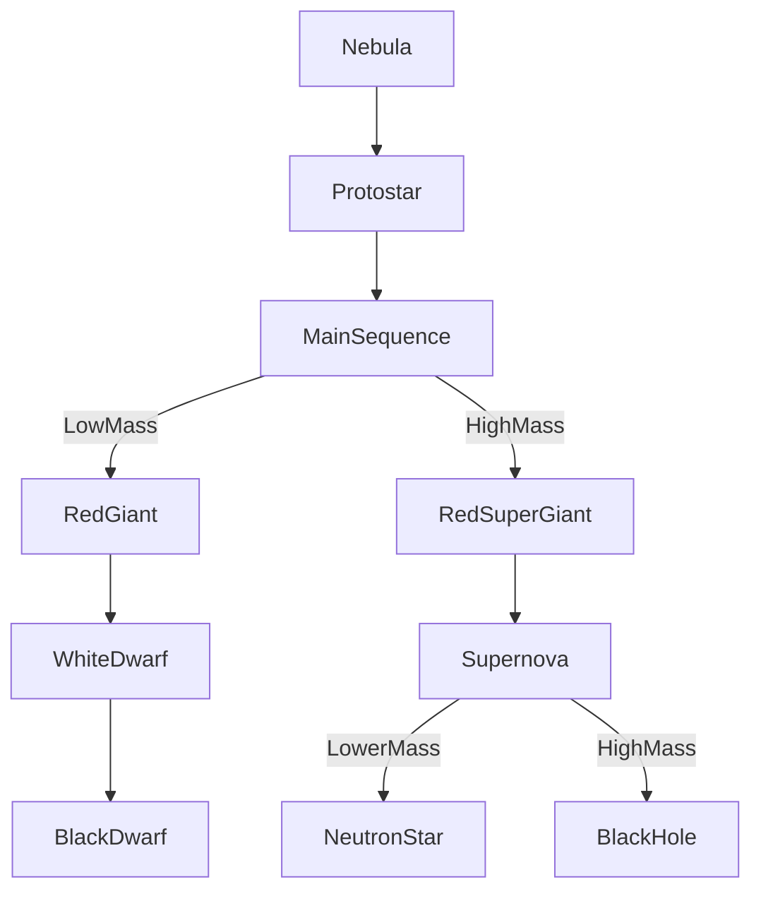

```mermaid
graph TD;
    Nebula --> Protostar;
    Protostar --> MainSequence;
    MainSequence -->|LowMass| RedGiant;
		RedGiant --> WhiteDwarf
		WhiteDwarf --> BlackDwarf
	MainSequence -->|HighMass| RedSuperGiant;
		RedSuperGiant --> Supernova
		Supernova -->|LowerMass| NeutronStar
		Supernova -->|HighMass| BlackHole
	
```
If the bigger stars have more than 8x the mass of our sun they will become a super giant.